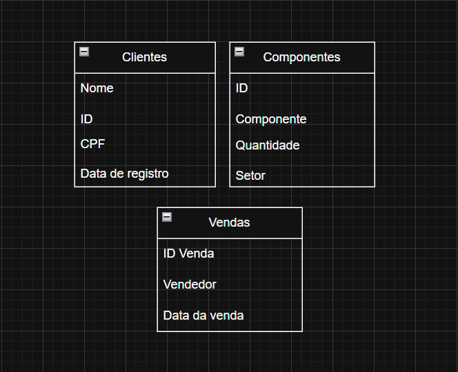
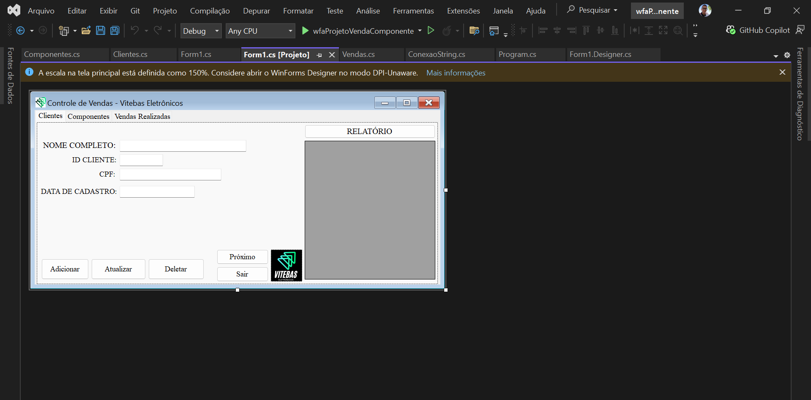
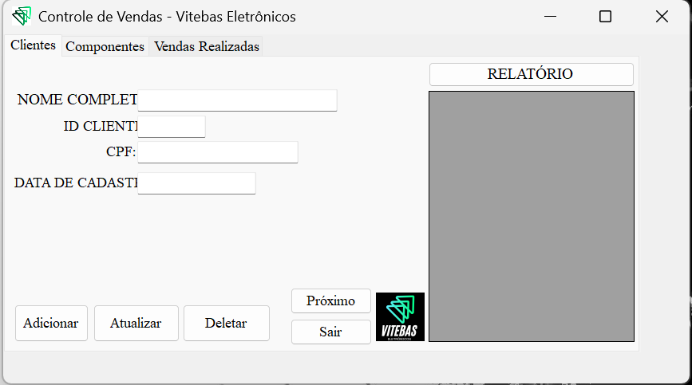
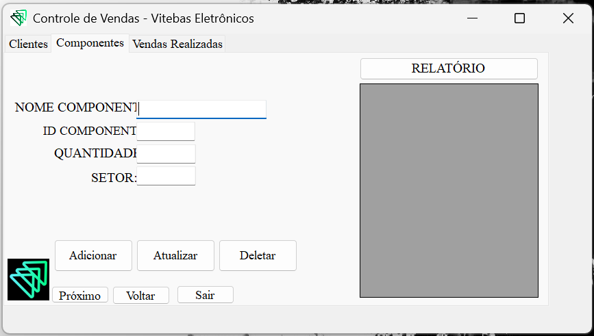
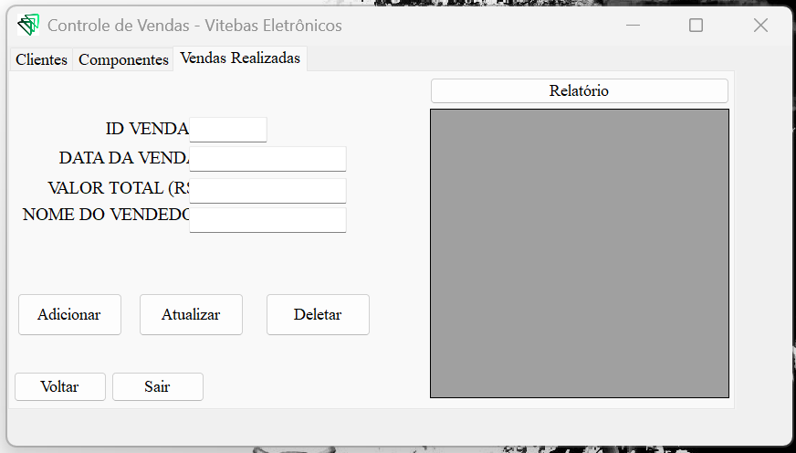

# 📚 Projeto Final POO - Integração C# e DB

Neste projeto, foi desenvolvido um **sistema de venda de componentes** desenvolvido em **C#** utilizando **Programação Orientada a Objetos (POO)** e integrado a um **banco de dados**. O sistema foi criado para **registrar clientes, componentes e vendas**, permitindo gerenciar de forma organizada todo o processo de comercialização de componentes para os clientes.  

A aplicação aplica conceitos fundamentais de POO, como **encapsulamento**, **herança** e **polimorfismo**, garantindo um código estruturado e de fácil manutenção. A integração com o banco de dados possibilita que todas as informações sejam armazenadas de forma segura, permitindo consultas rápidas e geração de relatórios confiáveis.  

Este projeto demonstra como construir uma aplicação C# robusta, organizada e capaz de gerenciar de forma eficiente operações de venda em um cenário realista.

---

## 🚀 Funcionalidades

- ✅ Registro de clientes
- ✅ Registro de Componentes
- ✅ Registro de Vendas (Componentes para clientes)
- ✅ Interface responsiva e amigável com Windows Forms
  
---

## 🛠️ Tecnologias Utilizadas


| 📌 Interface | ⚙️ Backend | 🗄️ Banco de Dados |
|---|---|---|
| Windows Forms - Microsoft Visual Studio | C# | PostgreSQL |

---

## 📂 Estrutura do Repositório

```bash
📁 .vs/
📁 wfaProjetoVendaComponente/
📝 wfaProjetoVendaComponente.sln/
```

---

## 🧑🏽‍💻 Criação do Projeto

1. Diagrama de funcionalidades:



---

## 🗂️ Banco de Dados

O projeto utiliza **PostgreSQL** para armazenar e gerenciar informações sobre clientes, componentes e vendas.

Ele mantém dados essenciais para o controle do sistema de vendas, como cadastros de clientes, registros de componentes disponíveis e histórico de vendas realizadas.

### 📌 Estrutura de Dados

As principais informações armazenadas incluem:

- **Clientes**: dados de cadastro, como nome, e-mail, telefone e endereço  
- **Componentes**: informações de cada peça, como nome, categoria, quantidade em estoque e preço  
- **Vendas**: histórico de vendas associando clientes e componentes, com data, quantidade e valor total  

## ⚙️ Configuração

### Instalação do driver PostgreSQL para C#
```powershell
Install-Package Npgsql
```

### Implementando tabelas
```
using Npgsql;

string connectionString = "Host=xxx;Username=xxx;Password=xxx;Database=xxx";
using var conn = new NpgsqlConnection(connectionString);
conn.Open();
Console.WriteLine("Conectado ao banco de dados PostgreSQL.");

using var cmd = new NpgsqlCommand(@"

CREATE TABLE IF NOT EXISTS clientes (
    id SERIAL PRIMARY KEY,
    nome VARCHAR(100) NOT NULL,
    email VARCHAR(100) UNIQUE NOT NULL,
    telefone VARCHAR(20),
    endereco TEXT
)", conn);
cmd.ExecuteNonQuery();
```

---

## 💻 Desenvolvimento Front-end



---

## 📊 Resultados Obtidos

Aqui estão algumas telas do projeto **Sistema Programação Orientada a Objetos**:







---

## ✍🏼 Considerações

Desenvolver esse projeto foi desafiador, mas extremamente enriquecedor. Permitindo aplicar conceitos de **Programação Orientada a Objetos**, integração com **banco de dados PostgreSQL** e desenvolvimento de funcionalidades reais de um sistema de vendas.  

O projeto proporcionou aprendizado prático sobre organização de código, manipulação de dados, tratamento de exceções e boas práticas de desenvolvimento. Além disso, reforçou a importância de manter uma **estrutura de dados clara e eficiente** para garantir a confiabilidade do sistema.  

Apesar dos desafios, o resultado final é um sistema funcional, escalável e pronto para futuras melhorias, como a implementação de interfaces gráficas mais avançadas, relatórios detalhados e integração com outras tecnologias.

<div align="center">
  
</div>
